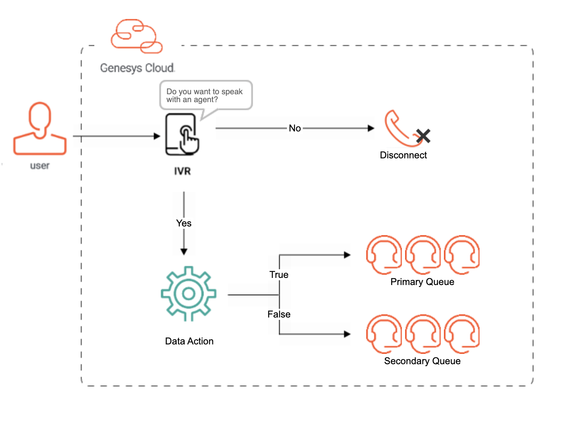

---
title: Integrate a public API call into an Architect flow
author: charlie.conneely
indextype: blueprint
icon: blueprint
image: images/CallFlow.png
category: 5
summary: |
  This Genesys Cloud Developer Blueprint provides an example of how to integrate a public API call into an Architect flow to check if any agents are available on a given queue and make routing decisions based on the outcome. 
--- 

This Genesys Cloud Developer Blueprint provides an example of how to integrate a public API call into an Architect flow to check if any agents are available on a given queue and make routing decisions based on the outcome.

## Scenario 

A customer wants to design an inbound call flow in Architect that will use a data action to determine if there are any agents available on a given queue. If not, the caller should be transferred to a secondary queue. This customer is unfamiliar with such an architecture and would like to see a working example configured in their organisation. 

## Solution

A configurable remote Terraform module that uses CX as Code and Archy to deploy all Genesys Cloud infrastructure such as queues, data actions, and Architect flows. 



## Contents

* [Solution Components](#solution-components "Goes to the Solution Components section")
* [Prerequisites](#prerequisites "Goes to the Prerequisites section")
* [Implementation steps](#implementation-steps "Goes to the Implementation steps section")
* [Test your flow](#test-your-flow "Goes to the testing section")
* [Additional resources](#additional-resources "Goes to the Additional resources section")

## Solution Components

* **Genesys Cloud** - A suite of Genesys Cloud services for enterprise-grade communications, collaboration, and contact center management. In this solution, you use an Architect inbound call flow, along with a Genesys Cloud integration, data action, queues, DID phone number and call route.
* **Archy** - A Genesys Cloud command-line tool for building and managing Architect flows.
* **CX as Code** - A Genesys Cloud Terraform provider that provides a command line interface for declaring core Genesys Cloud objects.

## Prerequisites

### Specialized knowledge

* Administrator-level knowledge of Genesys Cloud
* Experience using Terraform
* Experience using Archy

### Genesys Cloud account

* A Genesys Cloud license. For more information, see [Genesys Cloud Pricing](https://www.genesys.com/pricing "Opens the Genesys Cloud pricing page") in the Genesys website.
* Master Admin role. For more information, see [Roles and permissions overview](https://help.mypurecloud.com/?p=24360 "Opens the Roles and permissions overview article") in the Genesys Cloud Resource Center.
* Archy. For more information, see [Welcome to Archy](https://developer.genesys.cloud/devapps/archy/ "Goes to the Welcome to Archy page").
* CX as Code. For more information, see [CX as Code](https://developer.genesys.cloud/api/rest/CX-as-Code/ "Opens the CX as Code page").

### Development tools running in your local environment
- Terraform (the latest binary). For more information, see [Download Terraform](https://www.terraform.io/downloads.html "Opens the Download Terraform page") in the Terraform website.
- Archy. For more information, see [Archy Installation](https://developer.genesys.cloud/devapps/archy/install "Opens the Archy Installation page") 

## Implementation steps

### Define the environment variables

First define the environment variables that hold the OAuth credential grant that is used by CX as Code to provision the Genesys Cloud objects.

- `GENESYSCLOUD_OAUTHCLIENT_ID` - This is the Genesys Cloud client credential grant Id that CX as Code executes against.
- `GENESYSCLOUD_OAUTHCLIENT_SECRET` - This is the Genesys Cloud client credential secret that CX as Code executes against.
- `GENESYSCLOUD_REGION` - This is the Genesys Cloud region in which your organization is located.
- `GENESYSCLOUD_ARCHY_LOCATION` - The location for the organization (e.g mypurecloud.com)

### Clone the repo

Clone the [architect-flow-public-api-blueprint](https://github.com/GenesysCloudBlueprints/architect-flow-public-api-blueprint "Opens the project repository on GitHub") repository on GitHub.

**Note:** You can also avoid cloning the repo entirely by referencing the remote module where it is stored on GitHub. To do this, create your own `main.tf` file, copy the contents of `files/main.tf` over, and change the value associated with the `source` parameter to `"github.com/GenesysCloudBlueprints/architect-flow-public-api-blueprint//blueprint/files/modules/check-queue-flow"`. You will also need to copy [archy_flow.yml](https://github.com/GenesysCloudBlueprints/architect-flow-public-api-blueprint/blob/main/blueprint/files/archy_flow.yml "Opens the exported Archy file in the project repository on GitHub") to the same directory. 

### Configure the Terraform module

Inside `files/main.tf`, configure the module with the phone numbers that you want to associate with the IVR, and with the user IDs of the primary and secondary queue members.
 
```hcl
module "check_queue_flow" {
    source = "./modules/check-queue-flow"

    archy_flow_file_name       = "archy_flow.yml"
    did_numbers                = ["+1 234-567-8910"]
    primary_queue_member_ids   = []
    secondary_queue_member_ids = []
}
```

### Deploy

Deploy the Architect flow and Genesys Cloud objects

From the directory containing `main.tf` and `archy_flow.yml`, run:

```console
$ terraform init
$ terraform apply --auto-approve
```

## Test your flow

Dial a phone number that was provided to the `did_numbers` attribute in `main.tf`. If everything deployed correctly, you should hear "Welcome to the main menu. Press 1 to connect to an agent. Press 2 to disconnect." After pressing 1, you will be transferred to the primary or seconday queue depending on agent availability in the primary queue. 

## Additional resources

* [terraform.io](https://terraform.io "Opens www.terraform.io") 
* [CX as Code](https://developer.genesys.cloud/api/rest/CX-as-Code/ "Opens the CX as Code page in the dev center") 
* [Genesys Cloud provider documentation](https://registry.terraform.io/providers/MyPureCloud/genesyscloud/latest/docs "Opens the Genesys Cloud provider docs on registry.terraform.io") 
* [Archy](https://developer.genesys.cloud/devapps/archy/ "Opens the Archy documentation in the dev center") 
* ["Deploy a simple IVR using Terraform, CX as Code, and Archy"](https://developer.genesys.cloud/blueprints/simple-ivr-deploy-with-cx-as-code-blueprint/ "Opens a blueprint on the dev center") - A blueprint that describes provisioning the resources needed for an IVR flow using CX as Code and the deployment phases of those Genesys Cloud objects. 
* The [architect-flow-public-api-blueprint](https://github.com/GenesysCloudBlueprints/architect-flow-public-api-blueprint "Opens the project repository on GitHub") repository on GitHub